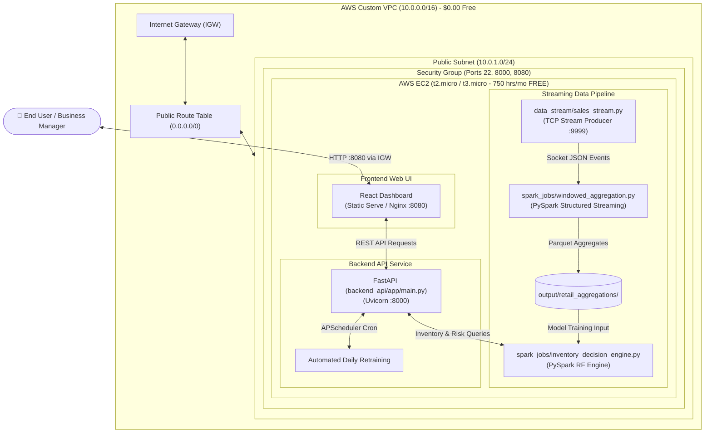

# ☁️ AWS Free-Tier Non-Docker Deployment Guide

This guide provides a comprehensive, step-by-step walkthrough to deploy the **AI-Powered Real-Time Inventory Management System** on AWS within the **AWS Free Tier** ($0/month cost model), using a **Non-Docker (Bare-Metal)** architecture for optimal memory efficiency.

---

## 🏗️ System Architecture (Non-Docker)

Running natively without Docker container overhead saves ~200 MB of RAM, which is ideal for AWS Free Tier `t2.micro` / `t3.micro` instances with 1 GB RAM limit.



---

## 💰 AWS Free Tier Cost Breakdown

| Component | AWS Resource | Free Tier Usage Limit | Estimated Monthly Cost |
| :--- | :--- | :--- | :--- |
| **Compute** | EC2 `t2.micro` or `t3.micro` | 750 hours / month (12 months free) | **$0.00** |
| **Storage** | Elastic Block Store (EBS) | 30 GB SSD (gp2/gp3) storage free | **$0.00** |
| **Network Data Out** | EC2 Data Transfer | 100 GB / month free | **$0.00** |
| **Total** | | | **$0.00 / month** |

---

## 📋 Step-by-Step Deployment Instructions

### Step 0: Create a Custom AWS VPC (Free)

1. Go to AWS Console $\rightarrow$ **VPC** service.
2. Click **Create VPC**.
3. Select **VPC and more** (this automatically sets up subnets, route tables, and internet gateway).
4. **Name tag auto-generation:** `inventory-vpc`
5. **IPv4 CIDR block:** `10.0.0.0/16`
6. **Number of Availability Zones (AZs):** `1`
7. **Number of public subnets:** `1` (`10.0.1.0/24`)
8. **Number of private subnets:** `0`
9. **NAT Gateways:** `None` *(Important: NAT gateways cost money, keep set to None for 100% free tier)*.
10. **VPC Endpoints:** `None`.
11. Click **Create VPC**.

---

### Step 1: Launch AWS EC2 Instance inside Custom VPC

1. Navigate to **EC2** $\rightarrow$ Click **Launch Instance**.
2. Configure settings:
   - **Name:** `inventory-ai-server`
   - **AMI:** `Ubuntu 22.04 LTS` (Free Tier Eligible)
   - **Instance Type:** `t2.micro` or `t3.micro`
   - **Key Pair:** Select or create `inventory-key.pem`
3. Under **Network Settings**:
   - Click **Edit**.
   - **VPC:** Select your custom `inventory-vpc`.
   - **Subnet:** Select your public subnet `inventory-subnet-public1`.
   - **Auto-assign Public IP:** Select **Enable** *(Crucial so you can connect over the internet)*.
4. Under **Security Group**:
   - Create Security Group named `inventory-sg`.
   - Add **SSH (22)** from `0.0.0.0/0`.
   - Add **Custom TCP (8000)** (FastAPI) from `0.0.0.0/0`.
   - Add **Custom TCP (8080)** (React App) from `0.0.0.0/0`.
5. Click **Launch Instance**.

---

### Step 2: Connect to EC2 & Clone Repository

1. Open your terminal or PowerShell on your computer.
2. SSH into your EC2 instance using your `.pem` key:
   ```bash
   chmod 400 inventory-key.pem
   ssh -i "inventory-key.pem" ubuntu@<YOUR-EC2-PUBLIC-IP>
   ```
3. Clone your project code into the instance:
   ```bash
   git clone <YOUR-GITHUB-REPOSITORY-URL> inventory_ai
   cd inventory_ai
   ```

---

### Step 3: One-Click Non-Docker Deployment

Make the non-docker deployment script executable and run it:

```bash
chmod +x deploy_ec2_nodocker.sh
./deploy_ec2_nodocker.sh
```

#### What `deploy_ec2_nodocker.sh` Automatically Does:
1. **Configures 2 GB Swap Memory**: Prevents PySpark/JVM memory crashes on 1 GB RAM EC2 instances.
2. **Installs System Dependencies**: Installs Python 3.11, OpenJDK 11 (Java), and Node.js 18.
3. **Sets Up Python Environment**: Creates virtual environment and installs PySpark, FastAPI, Scikit-learn, and Pandas.
4. **Launches Background Processes**: Runs `sales_stream.py`, `windowed_aggregation.py`, and FastAPI backend in background processes via `nohup`.
5. **Builds & Serves Frontend**: Builds static React production bundle and serves it on Port `8080`.

---

### Step 4: Verify Deployment & Logs

After running the script, verify all processes are running:

```bash
# Check running Python & Node processes
ps aux | grep python
ps aux | grep node

# Monitor real-time logs
tail -f logs/stream.log     # Sales generator logs
tail -f logs/spark.log      # Spark streaming aggregation logs
tail -f logs/backend.log    # FastAPI backend logs
tail -f logs/frontend.log   # React web app logs
```

---

### Step 5: Access Your Live System

Open your browser and navigate to:

- 📊 **Interactive React Dashboard:** `http://<YOUR-EC2-PUBLIC-IP>:8080`
- ⚡ **FastAPI REST API Docs:** `http://<YOUR-EC2-PUBLIC-IP>:8000/docs`
- 🔍 **Health Check Endpoint:** `http://<YOUR-EC2-PUBLIC-IP>:8000/health`

---

## 🛠️ Maintenance & Useful Commands

| Action | Command |
| :--- | :--- |
| **Stop All Services** | `pkill -f python3 && pkill -f node` |
| **Restart Backend** | `cd backend_api && nohup ../venv/bin/uvicorn app.main:app --host 0.0.0.0 --port 8000 > ../logs/backend.log 2>&1 &` |
| **Check Memory Usage** | `free -h` |
| **Check Disk Usage** | `df -h` |
